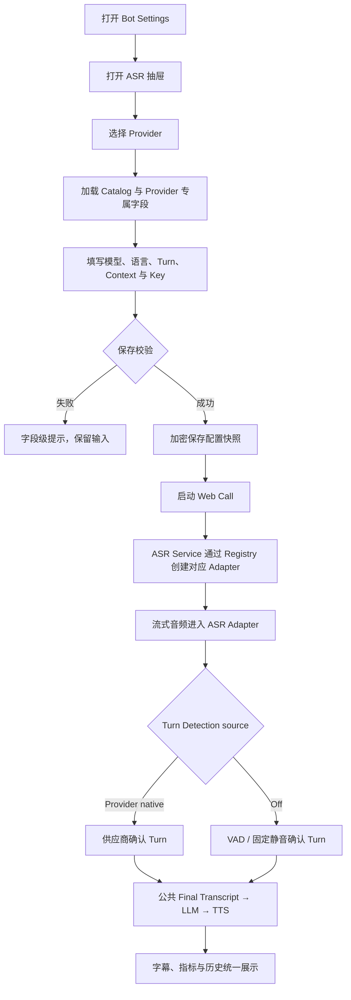
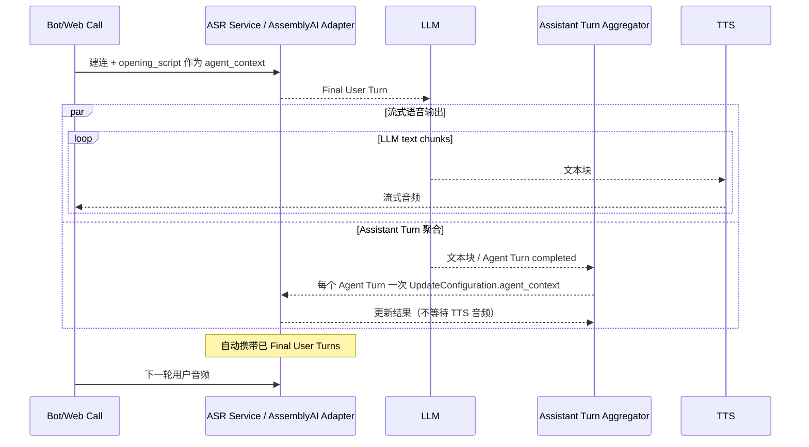
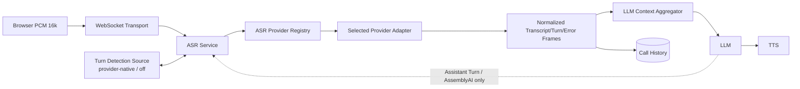
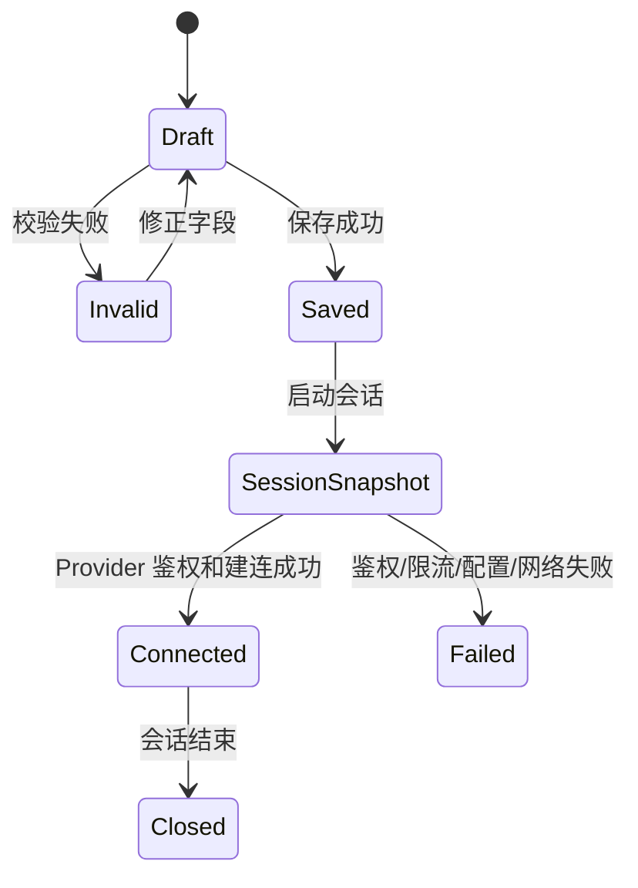

# VoiceAgent 流式 ASR 多供应商接入产品需求文档（PRD）

版本号：V1.0.17

| 版本 | 时间 | 修订人 | 备注 |
|---|---|---|---|
| V1.0.0 | 2026/09/24 | Codex | 创建评审草案；仅定义需求与原型，不授权开发 |
| V1.0.1 | 2026/09/24 | Codex | 补充 ASR Service 抽象、可切换 Turn Detection 与并行 Context 更新 |
| V1.0.2 | 2026/09/24 | Codex | 澄清 LLM→TTS 保持流式，Context 更新不依赖 TTS 音频完成 |
| V1.0.3 | 2026/09/24 | Codex | Provider 改为可扩展下拉；按四家真实协议校正 Language 与 Advanced 字段 |
| V1.0.4 | 2026/09/24 | Codex | 确认 AssemblyAI Agent Context 每个 Agent Turn 仅更新一次且只使用本轮 Agent 回复 |
| V1.0.5 | 2026/09/24 | Codex | Provider Key 改为全局复用；Key 区域回归线上顺序与保存交互 |
| V1.0.6 | 2026/09/24 | Codex | Speechmatics 改用当前 Language Pack Catalog，并校正 Realtime Enhanced 的 `model` 字段 |
| V1.0.7 | 2026/09/24 | Codex | Soniox Language hints 改为基于模型 Catalog 的可搜索多选，并补齐添加、移除与空值状态 |
| V1.0.8 | 2026/09/24 | Codex | 将当前高保真原型的页面层级、四家字段交互、Catalog 来源、全局凭证与响应式规则完整同步进 PRD |
| V1.0.9 | 2026/09/24 | Codex | Turn Detection Source 收敛为 Provider native / Off；Self-developed 仅保留为未来规划 |
| V1.0.10 | 2026/09/24 | Codex | Deepgram 增加 Nova-3 V1 Streaming，独立于 Flux 配置；校正 Soniox 关闭 Endpoint Detection 后缺少自动轮次边界的限制 |
| V1.0.11 | 2026/09/24 | Codex | Turn Source 按模型固定：Soniox 仅 Provider native、Nova-3 仅 Off；Speechmatics Off 映射 silence trigger=0 |
| V1.0.12 | 2026/09/24 | Codex | 纠正 Off 语义：关闭智能 Turn Detection 但保留 VAD/固定静音切分；Speechmatics 映射 Fixed + 正数阈值，Nova-3 保留 silence endpointing；AssemblyAI Off 继续禁用 |
| V1.0.13 | 2026/09/27 | Codex | 校正 Speechmatics 句子分段、Maximum EOU delay 与 permitted marks：区分句子 Final 和 Turn Final，补充 10.0 s 默认及动态下限，并把标点改为 `all`/自定义数组契约 |
| V1.0.14 | 2026/09/27 | Codex | AssemblyAI Mode 选择后自动回填三个 Turn 预设值并允许修改；明确 `vad_threshold` 为独立的内置 Silero VAD 灵敏度 |
| V1.0.15 | 2026/09/27 | Codex | D-015 将凭证改为按 Bot、组件与 Provider 保存；资源管理页与全局复用延后 |
| V1.0.16 | 2026/09/28 | Codex | 依 external-real 服务端契约明确 `permitted_marks="all"` 是产品内部值，wire 上必须省略；显式子集才发送数组。该修订仅纠正传输映射，不改变已冻结的产品/UI 语义或原型 hash |
| V1.0.17 | 2026/09/28 | Codex | User Gate 2 反馈修订：账号 Catalog 刷新改为紧凑次级描边按钮；Soniox 与 AssemblyAI 语言项显示 `code (English name)`，Soniox 原有搜索支持匹配 code/名称，提交值仍为 code |

## 一、概述（为什么做）

### 1.1 产品概述及目标

#### 1.1.1 背景介绍

VoiceAgent 当前实时语音链路只支持 Deepgram Flux ASR，Bot 配置、会话凭证、Pipeline 工厂和前端参数均围绕 Flux 建模，无法在同一产品内选择和验证其他流式 ASR。项目需要在 Deepgram 下增加 Nova-3，并新增 Speechmatics Realtime Enhanced、Soniox `stt-rt-v5`、AssemblyAI Universal-3.5 Pro Realtime，同时保留 Flux 作为现有兼容基线。

AssemblyAI 还提供 Conversation Context：服务端自动携带已 Final 的用户历史，VoiceAgent 可把 Agent 最近一次回复通过 `agent_context` 提供给下一轮识别，用于短回答、数字、账号和歧义词消歧。该能力不同于普通热词，必须在产品配置、运行状态和历史证据中明确标识。

#### 1.1.2 产品概述

本 Change 在现有 Bot Settings 的 ASR 组件抽屉中增加三个供应商，允许用户按 Bot 选择供应商、模型、语言、Turn Detection、上下文与供应商专属参数，并使用按 Bot、组件与 Provider 加密保存的凭证启动 Web Call。所有供应商继续输出统一的转写、打断、Turn 结束和时延数据，使后续 LLM、TTS、历史与页面无需理解供应商协议。

#### 1.1.3 产品目标

**业务目标**

| 目标 | 指标 | 目标值 | 达成时间 |
|---|---|---|---|
| 扩大实时 ASR 可选范围 | 可创建并保存的实时 ASR provider | Deepgram + 新增三家 | User Gate 2 |
| 保持主链路稳定 | 切换 ASR 后 LLM/TTS/历史公共契约 | 无 provider 专属分支泄漏到下游 | User Gate 2 |
| 引入对话上下文能力 | AssemblyAI Agent Context | 开场和后续 Agent 回复可进入下一轮 ASR | User Gate 2 |
| 保证密钥安全 | Key 明文出现在响应/日志/配置 | 0 | 持续 |

**用户目标**

| 目标用户 | 用户目标 | 衡量指标 |
|---|---|---|
| 语音 AI 产品/交付经理 | 在同一 Bot 编辑器选择四家 Provider 与五个实时模型分支 | 配置可保存、回显并用于真实会话 |
| 测试与验收人员 | 对照字幕、Turn 行为与延迟判断供应商/模型适配效果 | 四家 Provider 使用同一历史与指标展示 |
| 研发人员 | 用统一契约扩展供应商而不复制 Pipeline | Pipeline 只依赖 ASR Registry 和公共 Frame |

#### 1.1.4 目标用户

| 角色 | 描述 | 核心诉求 |
|---|---|---|
| VoiceAgent 管理员 | 配置 Bot 与供应商凭证 | 参数合法、密钥安全、供应商切换清晰 |
| VoiceAgent 测试人员 | 发起 Web Call 并检查转写 | Turn 自然、字幕稳定、错误可诊断 |

### 1.2 名词说明

| 名词 | 说明 |
|---|---|
| ASR Service | VoiceAgent 面向 Pipeline 的统一流式识别接口；负责生命周期、音频输入、统一事件与可选控制命令，不暴露供应商协议 |
| Provider-native Turn Detection | 使用供应商自己的语义端点或 EOT 判定用户是否说完 |
| Turn Detection Off | 关闭语义、声学或模型原生的智能 Turn Detection，但保留 Provider 支持的 VAD/固定静音切分；不是关闭自动轮次，也不是等待流结束 |
| Self-developed Turn Detection | 未来由 VoiceAgent 自研的统一 Turn Detection；本期尚不存在，不出现在可选项、配置枚举或实现范围中 |
| Agent Context | 当前 Agent Turn 的完整回复文本，用于 AssemblyAI 下一轮识别；不按实际播放进度截断 |
| Context Carryover | AssemblyAI 在同一 WebSocket 内自动携带已 Final 用户 Turn 的能力 |
| Static Context | 会话建立时提供且会话内不动态变化的领域文本、词汇或术语 |
| Final Transcript | 已稳定、允许进入 LLM 和历史记录的用户转写 |

### 1.3 角色及权限

沿用现有受保护 Demo 的共享管理员权限；本 Change 不新增账号、角色或供应商控制台权限。只有已登录用户可读取 Catalog、编辑 Bot、保存 Key 和发起测试会话。

### 1.4 文档阅读对象

| 对象 | 关注内容 |
|---|---|
| 产品/UI | Provider 切换、字段层级、上下文说明、失败提示 |
| 研发 | ASR Registry、配置/凭证边界、Turn 归一化 |
| 测试 | 状态矩阵、异常、打断、时延与上下文验收 |
| 安全/交付 | Key 加密、日志脱敏、真实外部调用授权 |

## 二、产品描述（做什么）

### 2.1 产品需求描述

本期新增：

- Speechmatics：Realtime Enhanced；语言、Additional vocabulary、原生 Turn Detection 参数。
- Soniox：`stt-rt-v5`；语言提示、Static Context、原生语义 Endpoint Detection 参数。
- AssemblyAI：`universal-3-5-pro`；语言、Mode、Prompt/Keyterms、Agent Context、Context Carryover 和原生 Turn Detection 参数。
- Deepgram Flux：保持现有行为和配置，作为迁移兼容基线。
- Deepgram Nova-3：使用 V1 Streaming 与独立的语言、Endpointing、格式化和 Keyterm 配置，不复用 Flux EOT。
- 每个 Bot 只能选择一个实时 ASR；Chat Test 继续绕过 ASR。
- 浏览器输入仍固定为 16 kHz、16-bit、单声道 PCM；8 kHz 电话接入不在本期。
- 不包含横向 Benchmark、供应商排名、自动选型、电话网关或生产客户数据跑批。

### 2.2 产品整体流程

#### 2.2.1 主流程

#### 2.2.2 AssemblyAI 上下文子流程

#### 2.2.3 数据流

#### 2.2.4 Bot ASR 配置状态

### 2.3 全局说明

#### 2.3.1 全局异常处理

| 异常场景 | 处理方式 | 用户提示 |
|---|---|---|
| Catalog 加载失败 | ASR 依赖控件禁用，允许重试 | “ASR capabilities failed to load. Retry.” |
| Key 缺失或鉴权失败 | 允许保存 Bot 配置但阻止真实会话，Key 不回显 | “The selected ASR credential is unavailable or invalid.” |
| 不支持的参数组合 | 字段级校验，不静默修正 | 展示具体字段规则 |
| Provider 限流/额度不足 | 当前会话安全失败，保留 Bot | “ASR service is rate limited or unavailable.” |
| WebSocket 中断 | 结束当前会话，不把 partial 当 Final | “ASR connection was interrupted.” |
| Context 更新失败 | 记录安全诊断；不得伪装已应用 | “Conversation context could not be updated.” |

#### 2.3.2 全局交互

- 切换 Provider 时，专属字段整体替换；不得把上一供应商的参数提交给新供应商。
- 已保存 Bot 切换 Provider 后，旧 Provider Key 不自动当作新 Provider Key。
- Provider 使用单一可扩展下拉列表，不平铺供应商卡片。
- 抽屉顺序固定为：Provider → Model/Audio Input → Provider 语言控件 → Turn Detection source → AssemblyAI Context 提示（仅 AssemblyAI）→ Advanced → Provider credentials → Apply/Discard。
- 当前 Gate 1 原型默认展开 Advanced，便于逐项评审；正式页面必须记住或明确规定展开状态，不得改变字段归属。API Key 始终位于 Advanced 之后，不属于基础参数区。
- 所有帮助文案说明准确率/延迟取舍，但不展示未经本项目实测的性能结论。
- 浮层与抽屉只允许纵向滚动，固定桌面与窄屏不得出现横向滚动。

### 2.4 产品版本规划

| 版本 | 范围 | 状态 |
|---|---|---|
| V1.0 | PRD、Delta Spec、可运行原型、决策闭环 | 本 Change 当前阶段 |
| V1.1 | Registry、配置/凭证迁移、四家 Provider/五个模型分支 Adapter、正式 UI | Gate 1 后开发 |
| V1.2 | Mock/本地测试、真实连通和独立验收 | Gate 1 后开发 |
| 后续 | 8 kHz 电话输入、统一 Benchmark、动态业务热词生成、Self-developedTurnDetection   | 不在本期 |

### 2.5 产品框架

- Bot Settings → ASR Component Card → ASR Drawer
- Provider Catalog → provider/model/language 能力来源
- Provider-specific configuration → 每家独立严格校验
- Credential Vault → ASR/TTS/LLM 组件级加密凭证
- ASR Service → Pipeline 唯一依赖的识别抽象，管理流、事件、Turn 控制和 Context 控制
- ASR Provider Registry → 根据配置创建对应 Provider Adapter
- Turn Detection Source → 本期只提供 Provider-native 与 Off；Self-developed 为未来独立 Change
- Voice Pipeline → 公共 Transcript/Turn/Error/Metric
- Sessions → provider/model/context mode 证据与统一逐 Turn 指标

### 2.6 功能清单

| 模块 | 功能 | 优先级 | 版本 |
|---|---|---|---|
| Bot Settings | 四家 ASR Provider、五个模型分支选择与 Catalog 联动 | P0 | V1.1 |
| Bot Settings | Provider 专属参数与字段校验 | P0 | V1.1 |
| Credentials | ASR/TTS/LLM 组件级加密 Key | P0 | V1.1 |
| Pipeline | ASR Service、Provider Registry 与公共 Frame 契约 | P0 | V1.1 |
| Pipeline | Provider-native / Off Turn Detection Source | P0 | V1.1 |
| AssemblyAI | Agent Context + Context Carryover | P0 | V1.1 |
| History | Provider、Model、Context mode 与缺失原因 | P1 | V1.1 |
| Verification | Mock、local-real、external-real 分级证据 | P0 | V1.2 |

## 三、功能需求（怎么做）

### 3.1 ASR Provider 选择与配置

原型入口：[Streaming ASR Providers Prototype](../../openspec/changes/add-streaming-asr-providers/prototypes/index.html)。User Gate 1 已于 2026-09-27 通过，原型是已冻结的视觉与交互基线；其中用于展示状态的示例值不自动成为生产默认值。

#### 3.1.1 用户故事

作为 VoiceAgent 管理员，我希望在 ASR 抽屉选择四家供应商及其模型，并只看到当前 Provider/model 支持的配置，以便创建可运行且可解释的 Bot。

#### 3.1.2 前置与后置条件

- 前置：用户已登录；Backend Catalog 加载成功。
- 后置：合法配置写入 Bot；会话启动时复制不可变快照。

#### 3.1.3 界面及交互

| 元素 | 类型 | 必填 | 默认/规则 | 操作反馈 |
|---|---|---:|---|---|
| Provider | 下拉单选 | 是 | 现有 Bot 保持 Deepgram | 切换后重建 Model、语言控件与 Advanced；允许未来继续追加 Provider |
| Model | 下拉 | 是 | Catalog 唯一允许值 | 不允许自由输入 |
| Language configuration | Provider-specific | 条件必填 | 必须映射真实 API 字段 | 不得把数组型 steering/hints 伪装成单语言下拉 |
| Audio Input | 只读 | 是 | PCM16 · 16 kHz · mono | 不允许修改 |
| Turn Detection source | 单选 | 是 | Provider native | 本期仅 `Provider native` / `Off`；Off 表示只用 VAD/固定静音切分，支持情况由 Provider/model Catalog 决定 |
| Advanced | 可折叠区 | 否 | Gate 1 原型默认展开 | 展示且只展示当前 Provider 专属参数；Off 隐藏智能 Turn 参数，但保留 VAD/固定静音阈值 |
| API Key | 密码输入 | 条件必填 | 位于 Advanced 之后；当前 Bot 已有 Key 时留空自动沿用 | 永不回显明文；不得出现 Use saved key 按钮 |
| Save API key | 开关 | 否 | 关闭 | 开启后按 Bot/组件/Provider 加密保存或替换，只影响当前 Bot |
| Apply ASR settings / Discard | 抽屉操作 | — | 固定在抽屉底部 | Apply 只提交当前 Provider 配置；Discard 放弃本次未保存编辑 |

#### 3.1.4 Provider 字段

| Provider | Model | 真实语言参数 | Advanced 参数 |
|---|---|---|---|
| Deepgram Flux · V2 | `flux-general-en` / `flux-general-multi` | EN 模型固定 English；Multi 使用可选 `language_hint[]` | `eot_threshold`、`eot_timeout_ms`、重复 `keyterm`、`profanity_filter`、`numerals`、`redact`；顺序与当前线上 ASR Advanced 一致 |
| Deepgram Nova-3 · V1 | `nova-3` | 必填单个 `language` BCP-47 code；从当前 Nova-3 Catalog 选择，支持 `multi`、`ar`、`ar-SA` 等官方值 | Turn Source 固定 Off；使用 V1 `endpointing=<正数毫秒>` 的 VAD/固定静音切分，不启用 Flux EOT；保留 `interim_results`、`vad_events`、重复 plain `keyterm`、`smart_format`、`numerals`、`profanity_filter`、`redact`、`diarize_model`；不得提交 `language_hint` |
| Speechmatics | Realtime，`model=enhanced` | 必填 `language` Language Pack；从官方 Discovery/Catalog 加载账号可用单语、双语和多语 Pack（如 `ar`、`ar_en`、`en_ms`、`cmn_en`、`cmn_en_ms_ta`）；Realtime 不提供 `auto` | Catalog 约束的 `domain`、`max_delay`、`include_partials`、Voice SDK `speech_segment_config.emit_sentences`、`turn_detection_mode`、`end_of_utterance_silence_trigger`、`end_of_utterance_max_delay`、结构化 `additional_vocab`、`punctuation_overrides` |
| Soniox | `stt-rt-v5` | 可选 `language_hints[]`；从所选模型的 `languages[]` 可搜索多选 ISO code，显示 `code (English name)`，不接受自由输入；`language_hints_strict` 独立开关；空值自动识别 | `enable_language_identification`、`endpoint_sensitivity`、`endpoint_latency_adjustment_level`、`max_endpoint_delay_ms`、Context `general[]`/`text`/`terms[]` |
| AssemblyAI | `universal-3-5-pro` | 可选 `language_codes[]` steering，显示 `code (English name)`，最多 10 项；空值使用 18 语种原生 code-switch，禁止展示成单语言下拉 | `mode`、`prompt`、`keyterms_prompt[]`、`continuous_partials`、`min_turn_silence`、`max_turn_silence`、`vad_threshold`、`interruption_delay`、`agent_context`、`previous_context_n_turns`、`voice_focus`、`voice_focus_threshold`、`speaker_labels`；格式化为模型内置，不暴露 `format_turns` |

#### 3.1.5 参数展示规则

- Advanced 只展示当前 Provider 的真实字段；切换 Provider 后必须移除上一家的字段和值。
- Deepgram 切换 Flux/Nova-3 时同时替换 Language、Turn 能力和 Advanced；两者使用不同 API 版本，不得保留或提交另一个模型的字段。
- `off` 只关闭并隐藏语义、声学或模型原生的智能 Turn 参数；Provider 的 VAD/固定静音阈值以及语言、Context、词汇、格式化和音频增强参数仍保持可编辑。
- `self_developed` 不属于本 Change，不得以禁用选项、占位选项或隐藏参数形式出现在当前页面。
- 参数名、枚举、范围和默认值来自后端 Catalog；原型中的推荐值仅作为静态评审 fixture，正式实现不得由前端硬编码。
- AssemblyAI `language_codes` 是 bias/steering 数组，不是硬限制；页面必须提供“留空 = 18 语种自动 code-switch”的清晰状态。
- Speechmatics Language Pack 不得硬编码少量示例值；Catalog 必须保留官方 code，并按账号合同过滤可用 Pack，选择语言后再联动其可用 domain/locale。
- Soniox `language_hints[]` 使用可搜索多选器；`Add language hint` 只允许选择 Catalog 项，以 `code (English language name)` 展示并支持按 code 或名称搜索，已选项可逐个移除或全部清空，提交仍只保存 code。数据源为后端 Catalog 对 Soniox `GET /v1/models` 中 `stt-rt-v5.languages[]` 的归一化结果；原型与 Checkpoint A 使用同结构的 60-language 版本化 fixture，浏览器不得持有 Provider Key 或直接请求 Soniox。

#### 3.1.6 原型字段与状态映射

以下表格用于把当前原型逐项映射为产品规则。“原型 fixture”只负责展示控件状态；新 Bot 的真实默认值必须由已确认的产品规则、Provider Catalog 或后端默认值决定。

**公共区域**

| 原型区域 | 当前展示 | 产品规则 |
|---|---|---|
| Provider | Deepgram、Speechmatics、Soniox、AssemblyAI 单一全宽下拉 | 不平铺卡片；未来新增 Provider 不改变页面结构 |
| Model + Audio input | 两列顶对齐，控件保持现有紧凑高度；Audio 为 `PCM16 · 16 kHz · mono` 只读 | 相邻帮助文案不得拉高 Model 控件；Audio contract 本期不可编辑 |
| Pipeline ASR card | 随 Provider、Model、Language/Context 状态更新摘要 | 摘要只展示已保存或当前编辑态，不作为配置来源 |
| Turn detection source | `Provider native` / `Off` | 选项由 Provider/model Catalog 控制：Soniox 仅 Native，Nova-3 仅 Off；不支持项禁用并解释 |
| Off 状态 | 帮助文案说明仅按 VAD/固定静音结束 Turn | 关闭语义/声学智能判定，但仍由支持该模式的 Provider 在固定静音后自动向 LLM/TTS 提交完整用户 Turn |
| Provider credentials | Advanced 之后的密码输入、Show、Get a key、Save API key、保存状态提示 | 按 `bot_id + component + provider` 保存；留空保留当前 Bot 已有 Key；无 `Use saved key`；原型不保存也不请求真实 Key |

**Deepgram Flux**

| 字段 | 原型状态 | 产品规则 |
|---|---|---|
| Model / Language | `flux-general-en` 或 `flux-general-multi`；EN 固定 English，Multi 使用 hints | 复用当前线上字段与校验，不引入新的 Deepgram 语义 |
| EOT threshold | slider fixture `0.70`，范围 `0.5–1.0` | 沿用现有契约；只在 Provider-native 模式展示 |
| EOT timeout | fixture `5000 ms`，范围 `500–60000 ms` | 沿用现有线上范围 |
| Recognition and formatting | Keyterms、Profanity filter、Numerals、Redact | 字段顺序、枚举和保存行为必须与当前线上 Deepgram 一致 |

**Deepgram Nova-3**

| 字段 | 原型状态 | 产品规则 |
|---|---|---|
| Model / API | `nova-3` · V1 Streaming | 使用 `/v1/listen`；不得复用 Flux V2 的 EOT 或语言字段 |
| Language | Catalog-backed BCP-47 单选；原型以 `ar-SA` 展示 | 可选值来自当前 Models & Languages Catalog；`multi` 与各单语/方言 code 为不同值，默认值由后端 Catalog/产品配置决定 |
| Streaming | Interim results 开、VAD events 开、Endpointing silence `300 ms` | `endpointing=<正数毫秒>` 提供 VAD/固定静音边界；VAD events 同时可作为识别元数据；fixture 不代表生产默认值 |
| Turn Detection Source | 固定 `Off`；Provider native 禁用 | Off 表示不用 Flux 类模型原生智能 Turn Detection；请求保留 Nova-3 V1 silence endpointing，并以 `speech_final=true` 自动提交完整用户 Turn |
| Keyterms | 一行一个 plain phrase | 每行映射一个重复 `keyterm`；不允许权重，不得用逗号/分号把多个词条塞入单参数 |
| Formatting/output | Smart format、Numerals、Profanity filter、Redact、Diarization model | `smart_format=true` 时不额外暴露冗余 `punctuate`；按语言和 Streaming 能力校验支持状态 |

**Speechmatics Realtime Enhanced**

| 字段 | 原型状态 | 产品规则 |
|---|---|---|
| Model | 固定 `enhanced` | 请求字段为 `model=enhanced`，不得使用旧 `operating_point` 文案 |
| Language pack | 62 个当前 Discovery fixture；为展示双语能力，原型选中 `ar_en` | 正式选项按账号可用 Catalog 过滤；保存官方 code；Realtime 不提供 `auto` |
| Domain | 随 Language Pack 联动；示例含 General、Medical、Financial、`bilingual-en` | 只展示当前 Pack 的 Catalog 可用值，不接受自由输入 |
| Recognition | Maximum delay fixture `0.7 s`、Include partials 开、Emit completed sentences 关 | Emit completed sentences 映射 Voice SDK `speech_segment_config.emit_sentences`，在同一用户 Turn 内提前输出稳定句子 Segment；它不是 Speechmatics wire field，不产生 `EndOfTurn`，下游必须聚合到真实 Turn 结束后才触发一次 LLM |
| Native Turn | Smart Turn、Adaptive、Fixed；Silence trigger fixture `0.5 s`；Maximum EOU delay `10.0 s` | `end_of_utterance_max_delay` 的 SDK 默认值为 `10.0 s`，必须严格大于当前 Silence trigger；SDK 未声明固定数值上限，因此 UI 使用动态下限而不虚构上限。Fixed 是无语义/声学智能判定的固定静音模式 |
| Off mapping | 选择 Off 后模式固定为 Fixed，保留 Silence trigger | 提交 `end_of_utterance_mode=FIXED` 与正数 `conversation_config.end_of_utterance_silence_trigger`；不得传 `0`，因为 `0` 会完全关闭 EndOfUtterance |
| Vocabulary / punctuation | 结构化 Additional vocabulary、sounds-like、Punctuation sensitivity、Permitted marks 模式 | `sensitivity` 范围 `0–1`、默认 `0.5`；产品配置以特殊值 `"all"` 表示全部支持标点，Adapter 在 wire 上省略 `permitted_marks`。用户选择 Custom subset 后按“一行一个 Unicode 标点字符”输入并发送为 `list[string]` |

**Soniox `stt-rt-v5`**

| 字段 | 原型状态 | 产品规则 |
|---|---|---|
| Language hints | 60-language Catalog 可搜索多选；每项显示 `code (English name)`；原型用 `ar (Arabic)`、`en (English)` 演示选中 Chip | 新 Bot 默认空数组并自动多语识别；`ar/en` 只是交互 fixture；不接受自定义 code，保存值仍为 code |
| Picker actions | `Add language hint`、按语言名/ISO code 搜索、点击添加、点击 Chip 移除、Clear all | 所有动作必须可键盘访问；Clear all 后明确显示 Automatic identification |
| Catalog source | `GET /v1/models` → `stt-rt-v5.languages[]` | 浏览器只消费后端归一化 Catalog，不直接携带 Soniox Key 请求 Provider |
| Language behavior | Strict language hints 关、Language identification 开 | 为原型 fixture；Strict 仅表示强偏置，不得宣称绝对禁止其他语言 |
| Native endpoint | Sensitivity fixture `0.3`（`-1.0–1.0`）、Latency level fixture `2`、Max delay fixture `1500 ms`（`500–3000`） | Soniox 固定 Provider native，因此始终展示；最终默认值与模型能力由 Catalog 校验 |
| Session context | `general[]` key/value、`text`、`terms[]` | 建连时发送，非每轮 Agent Context；示例 banking 内容不得当作产品默认值 |

**AssemblyAI Universal-3.5 Pro Realtime**

| 字段 | 原型状态 | 产品规则 |
|---|---|---|
| Language steering | 18-language `language_codes[]` picker；每项显示 `code (English name)`；空值显示 Automatic code-switching；最多 10 项 | 属于 bias/steering，不是单语言选择或硬限制；保存值仍为 code |
| Recognition | Mode 默认 `balanced`；Prompt；最多 100 个 `keyterms_prompt`；Continuous partials 开 | Mode 使用官方三档 `min_latency` / `balanced` / `max_accuracy` |
| Native Turn presets | 选择 Mode 后自动回填 Min silence / Max silence / Interruption delay；回填后可逐项修改 | `min_latency=128/640/0 ms`；`balanced=128/1280/500 ms`；`max_accuracy=512/2560/500 ms`。切换 Mode 必须覆盖三个旧值；手动修改后标记“已修改”，不增加虚构的 Provider `Custom` Mode |
| VAD threshold | 默认 `0.3`，范围 `0.0–1.0` | AssemblyAI 内置 Silero VAD 的语音检测灵敏度；越低越容易判定有人说话，越高越能减少噪声误触发，但可能漏掉轻声。它不判断语义是否完整，也不属于 Mode 回填的三个字段 |
| Conversation Context | Agent Context 开、User Context Carryover 开、`previous_context_n_turns=5` | 每个 Agent Turn 只发送一次本轮完整回复；不按播放前缀更新；Carryover 只来自同一 WebSocket 的 Final 用户 Turn |
| Audio focus and output | Voice Focus、threshold、Formatting always on 提示、Speaker labels | U3.5 Pro 不适用 legacy `format_turns`；不支持的组合必须禁用并解释 |

#### 3.1.7 原型响应式与可访问性规则

- 桌面 ASR Drawer 为右侧非模态抽屉；窄屏转为单列，仍使用相同字段、DOM 与业务状态，不另建静态页面。
- 所有两列字段顶对齐；最长帮助文案、Catalog code、Credential 状态与 Context 文案必须换行收缩，禁止产生横向滚动。
- Provider、Model、Language Pack 使用原生 label/select 语义；多选器必须暴露搜索标签、multiselect、选中状态和可移除动作；Switch 必须暴露状态。
- 抽屉仅允许必要的纵向滚动；固定桌面和 `390×844` 窄屏均需验证 `scrollWidth <= clientWidth`。

#### 3.1.8 异常/分支流程

- Provider 切换后存在未保存编辑：直接替换字段，但保存前只提交当前 Provider 数据。
- Bot 切换 Provider：只解析当前 Bot 为新 Provider 保存的 Key；若缺失，仍允许保存非密钥配置，但禁止启动真实会话。
- Catalog 与已保存旧值不一致：显示“不再支持”，阻止新会话，不能静默迁移。

### 3.2 Turn Detection Source

#### 3.2.1 用户故事

作为 VoiceAgent 管理员，我希望明确选择供应商智能 Turn Detection 或仅使用 VAD/固定静音切分，以便控制智能判断与确定性静音边界之间的取舍。

#### 3.2.2 业务规则

- `provider_native`：Deepgram Flux 使用模型原生 EOT；Speechmatics 使用 Smart Turn/Adaptive；Soniox 使用 semantic endpoint detection 和 `<end>`；AssemblyAI 使用 U3.5 Pro 标点/语音上下文 End-of-Turn。
- `off`：关闭语义、声学或模型原生的智能 Turn Detection，但保留 Provider 支持的 VAD/固定静音切分，并继续自动提交完整用户 Turn；不是把自动 Turn 全部关闭。
- Deepgram Nova-3 固定 `off`，Provider native 禁用；以 V1 `endpointing=<正数毫秒>` 产生 `speech_final=true`，作为 VAD/固定静音边界。
- `self_developed` 仅为未来规划；本期 UI、API 枚举、数据库配置、Adapter 和任务清单均不得出现该可选项。
- ASR Service 对 Pipeline 暴露同一事件契约，并隐藏各家 Provider-native 事件差异。
- 每家必须归一化为同一套 User Started、Interim、Final、User Stopped 和 Interruption 语义。
- 同一会话只能激活一个最终 Turn 裁决策略；可保留另一来源作为诊断信号，但不得重复提交用户 Turn。
- Provider Catalog 必须声明该模型支持的 Turn 模式与实现状态；未通过适配验证的模式在 UI 中禁用并解释原因。
- Soniox 固定 `provider_native`，Off 禁用；不得提交 `enable_endpoint_detection=false`。
- Nova-3 固定 `off`，请求提交正数 `endpointing` 静音阈值；以 `speech_final=true` 自动向 LLM/TTS 提交完整用户 Turn，不提交 Flux EOT 参数。
- Speechmatics Off 就是 Fixed silence：提交 `end_of_utterance_mode=FIXED` 和正数 `conversation_config.end_of_utterance_silence_trigger`；严禁映射为 `0`，因为 `0` 会完全关闭自动 EndOfUtterance。
- AssemblyAI Universal-3.5 Pro Realtime 没有 Provider-side VAD-only 模式：`min_turn_silence` 触发标点/上下文检查，`max_turn_silence` 只是固定静音兜底；因此本期固定 `provider_native` 并禁用 Off。若未来由 Pipecat/local VAD 发送 `ForceEndpoint`，属于 Self-developed/external Turn Detection 的后续范围。

### 3.3 AssemblyAI Conversation Context

#### 3.3.1 用户故事

作为 VoiceAgent 管理员，我希望 ASR 能利用 Agent 刚才的问题和已确认的用户历史，以提高短回答、数字和实体的识别。

#### 3.3.2 业务规则

- 使用同一条 AssemblyAI WebSocket 保持单次会话上下文。
- 第一轮前以 Opening Script 初始化 `agent_context`。
- LLM 文本块持续流向 TTS；Assistant Turn Aggregator 独立形成本轮 Agent 回复。
- 每个 Agent Turn 只异步发送一次 `UpdateConfiguration.agent_context`，不得等待 TTS 首包、末包或播放完成。
- Context 更新失败只影响下一轮 Context 证据，不阻塞已经启动的 TTS。
- `agent_context` 只使用本轮 Agent 回复；barge-in 时不追求实际播放文本前缀，不依据 Web/SIP 播放游标二次修订，也不在同一 Agent Turn 内渐进更新。
- 仅 Final 用户 Turn 进入服务端 carryover；不得把 partial、人工标注或其他 ASR 结果伪装为用户历史。
- 页面必须区分 Prompt、Keyterms、Agent Context 与自动 Carryover。
- Context 更新失败不得中断已经可用的基础 ASR，但必须记录该轮未应用原因。

### 3.4 凭证与会话快照

#### 3.4.1 业务规则

- ASR、TTS、LLM Key 按 `bot_id + component + provider` 区分；不同 Bot 可以使用不同账号，组件混搭时分别解析各组件 Key。
- 保存时使用 `VOICE_AGENT_STORAGE_KEY` 加密；API 只返回当前 Bot 对应凭证是否齐备。
- Provider 切换后只解析当前 Bot 为新 Provider 保存的凭证，不得误用旧 Provider 密文。
- Key 区域位于组件 Advanced 之后并沿用现网页交互：单一密码输入、Show 动作、`Save API key` 开关；已有 Key 时留空即沿用，不提供 `Use saved key` 按钮。
- 输入新 Key 并保存只替换当前 Bot 对应组件/Provider 的密文，不得影响其他 Bot。
- Bot 配置可在 Key 缺失时保存，但真实会话必须被阻止；会话创建后固定配置和凭证引用，后续轮换不影响运行中会话。

#### 3.4.2 数据字典

| 字段 | 类型 | 必填 | 说明 | 示例 |
|---|---|---:|---|---|
| asr_provider | Enum | 是 | 当前 ASR Provider | `assemblyai` |
| asr_model | String | 是 | Catalog 模型 ID | `universal-3-5-pro` |
| asr_language_config | JSON | 是 | Provider 语言配置 | `{"language_codes":["ar","en"]}` |
| asr_options | JSON | 是 | 严格校验后的专属配置 | `{"mode":"balanced"}` |
| turn_detection_source | Enum | 是 | `provider_native`/`off` | `provider_native` |
| credential_bot_id | UUID | 是 | 凭证所属 Bot | `bot_...` |
| credential_component | Enum | 是 | Bot 内唯一键之一：`asr`/`tts`/`llm` | `asr` |
| credential_provider | String | 是 | Bot 内唯一键之一：密钥所属 Provider | `assemblyai` |
| encrypted_secret | String | 是 | Fernet 密文；API 不对外返回 | 不对外返回 |
| context_mode | Enum | 是 | off/agent/full | `full` |

### 3.5 统一历史与诊断

- 历史保存 Provider、Model、Language、Context mode、ASR Final latency 与缺失原因。
- 日志和 API 错误只暴露安全分类、request/session ID 和可操作提示，不保存 Key 或完整供应商 payload。
- Provider 原始事件差异由 Adapter 消化，不在前端添加四套指标公式。

## 四、非功能需求（注意事项）

### 4.1 安全与合规

- 永不在日志、API 响应、错误详情、截图或原型 fixture 放置真实 Key。
- 真实客户音频或付费 API 调用必须逐次记录数据范围、接收方、费用上限、停止条件和用户授权。
- AssemblyAI 上下文可能包含业务话术和用户历史，必须遵循与转写文本相同的访问和留存边界。

### 4.2 统计与可观测性

| 事件 | 触发时机 | 安全属性 |
|---|---|---|
| asr_session_started | Provider 建连成功 | provider、model、context_mode |
| asr_session_failed | 建连/鉴权/限流失败 | provider、safe_error_category |
| asr_turn_final | Final 产生 | provider、latency_ms、language、context_applied |
| asr_context_updated | Context 更新结果 | provider、status、length_bucket；不含正文 |
| asr_turn_interrupted | 用户打断 | provider、turn_index |

### 4.3 性能与稳定性

- 核心音频热路径只使用异步 I/O。
- 外部连接、配置更新、关闭操作必须有显式超时。
- ASR Adapter 不得同步写 SQLite 或磁盘。
- Final latency、空结果率和断线必须可诊断；目标阈值需经真实测试后冻结，不在 PRD 中伪造。

### 4.4 数据库设计

推荐新增组件级凭证表，并把 Provider 专属配置存为版本化 JSON；具体迁移方式属于设计决策。旧 Deepgram Bot 必须无行为变化地迁移，并可回滚到原字段读取。

### 4.5 系统集成

| 系统 | 方向 | 协议 | 用途 |
|---|---|---|---|
| Speechmatics | VoiceAgent → Provider | Streaming SDK/WebSocket | Enhanced 实时转写与 Turn |
| Soniox | VoiceAgent → Provider | WebSocket | v5 实时转写、Context、Endpoint |
| AssemblyAI | VoiceAgent ↔ Provider | WebSocket v3 | U3.5 Pro、Turn、动态 Context |
| Deepgram | VoiceAgent ↔ Provider | WebSocket | Flux V2 基线 + Nova-3 V1 Streaming |

## 五、附录

### 5.1 验收标准与测试要点

| 功能 | 验收条件 | 优先级 |
|---|---|---|
| Provider Catalog | 四家 Provider/五个模型分支/语言只来自后端 Catalog | P0 |
| Speechmatics Language Pack | 展示账号可用完整 Pack；保留官方 code；Realtime 无 `auto`；Domain 随 Pack 联动 | P0 |
| Speechmatics Advanced | 句子 Segment 不提前结束 Turn；Maximum EOU 默认 `10.0 s` 且严格大于 Silence trigger；Permitted marks 支持默认 `all` 与自定义字符串数组 | P0 |
| Soniox Language hints | 60-language fixture 可搜索添加/移除/清空；正式数据来自 `stt-rt-v5.languages[]`；空数组为自动识别 | P0 |
| AssemblyAI Language steering | 18-language picker 支持多选且最多 10 项；空值为自动 code-switching | P0 |
| 配置隔离 | 切换 Provider 后不提交上一家的专属字段 | P0 |
| Key 安全 | 响应、日志、历史、错误均无明文/密文 Key | P0 |
| Key 交互 | Credentials 位于 Advanced 之后；留空沿用当前 Bot Key；无 `Use saved key`；替换只作用于当前 Bot | P0 |
| Pipeline | 四家 Provider/五个模型分支均通过 ASR Service 产生公共 Interim/Final/Turn/错误事件 | P0 |
| Turn Detection Source | 下拉只提供 Native/Off；Native 与 VAD-only Off 都只能提交一个最终 Turn；无 VAD-only 能力的模型禁用 Off；Self-developed 不出现 | P0 |
| Assembly Context | Opening 与后续 Agent 回复可用于下一用户 Turn | P0 |
| Context 并行性 | LLM 文本保持流式进入 TTS；Context 独立更新且不等待 TTS 音频完成 | P0 |
| 打断 | Agent 播放时用户开口，残留输出不污染下一轮 | P0 |
| 历史 | Provider、Model、Context mode、Final latency 可追溯 | P1 |
| 响应式 | ASR 抽屉桌面和窄屏 `scrollWidth <= clientWidth` | P0 |
| 字段尺寸 | Model 等紧凑控件不被相邻帮助文案拉高；两列字段顶对齐 | P1 |
| 故障 | 鉴权、限流、超时、断线均安全失败并可恢复下一会话 | P0 |

### 5.2 待确认项清单

#### 必须确认（阻塞开发）

无。User Gate 1 已于 2026-09-27 通过 D-014 确认，当前原型已冻结唯一 SHA-256 baseline，可进入正式开发。

#### 已确认

1. 新 Change 范围为三家实时 ASR 产品接入，并参考现有 Deepgram Flux。
2. 必须先完成 PRD、Delta Spec 和原型确认，确认前不开发正式功能。
3. ASR 与 TTS 必须按组件独立选型；AssemblyAI ASR + Deepgram TTS 是合法组合。
4. 本期 Turn Detection Source 仅支持 Provider-native 与 Off；Self-developed 后续另行规划，不出现在当前选项中。
5. LLM→TTS 保持流式；AssemblyAI Context 由独立聚合分支更新，不以音频生成或播放完成为前置条件。
6. Pipeline 通过显式 ASR Service 抽象访问各供应商 Adapter。
7. AssemblyAI `agent_context` 每个 Agent Turn 只更新一次，仅使用本轮 Agent 回复，不追求实际播放文本前缀。
8. Provider Key 按 Bot、组件与 Provider 分开保存；不同 Bot 可使用不同 Key，资源管理页与全局复用留待后续；Key 区域位于 Advanced 之后并沿用线上保存交互。
9. 当前有效行为规格为 PRD V1.0.17；D-019/D-020 修订后的原型及其 SHA-256 是唯一有效的视觉与交互基线。任何后续有意偏离仍须先更新 Change 并重新确认。
