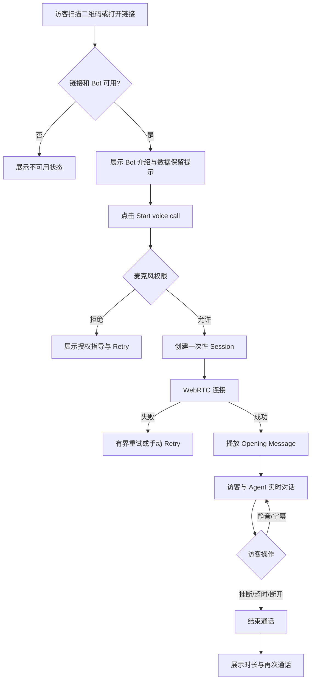
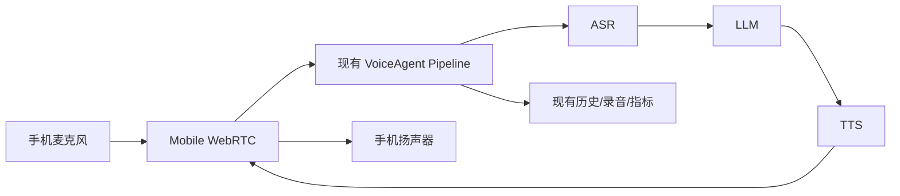
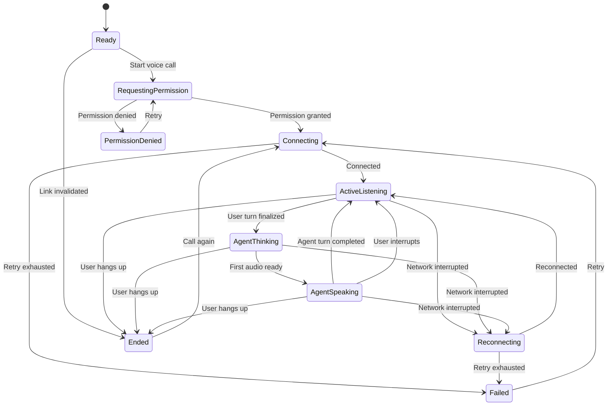

# VoiceAgent Mobile Web Call 产品需求文档（PRD）

版本号：V0.1.3（已确认产品基线）

| 版本 | 时间 | 修订人 | 备注 |
|---|---|---|---|
| V0.1.0 | 2026-09-29 | Codex | 产品范围与原型已确认；进入开发前仍需建立并确认 OpenSpec Change |
| V0.1.1 | 2026-09-29 | Codex | 补充后台 Share 页面、二维码/Web Link 管理与已确认原型 |
| V0.1.2 | 2026-09-29 | Codex | 确认独立公开文案与显式发布快照语义 |
| V0.1.3 | 2026-09-29 | Codex | 确认公开 Demo 凭据跟随 Bot 的 Provider 凭据库 |

> 本文只定义产品目标、用户流程与页面行为；不包含 OpenSpec Delta Spec、技术 design 或正式实现任务。

## 一、概述（为什么做）

### 1.1 产品概述及目标

#### 1.1.1 背景介绍

当前 VoiceAgent 主要通过桌面管理后台的 Web Call 页面验证 ASR、LLM 与 TTS。该页面承担 Bot 配置、测试、历史和指标等研发验证职责，不适合面向访客做轻量演示：入口复杂、桌面感强、需要解释配置含义，且当前 WebSocket 音频链路在移动网络下缺少 WebRTC 原生的抖动缓冲、回声消除与弱网处理。

由于中国大陆真实 SIP 线路需要企业资质，本阶段不接电话网，也不验证未来 SIP 架构，而是提供一个手机浏览器可直接打开的 VoiceAgent Demo Call。

#### 1.1.2 产品概述

Mobile Web Call 是一个面向演示访客的移动端语音通话页。访客扫描二维码或打开分享链接后，无需登录、无需填写 API Key，只需允许麦克风并点击开始，即可通过 WebRTC 与一个预先配置并发布的 Bot 实时对话。

桌面管理后台继续负责 Bot 配置、发布与历史查看；移动页面只负责体验通话，不暴露模型、密钥和技术指标。

#### 1.1.3 产品目标

**业务目标**

| 目标 | 指标 | 建议目标值 | 评估方式 |
|---|---|---:|---|
| 降低演示门槛 | 扫码至发起通话所需用户操作 | ≤ 2 次点击 | 可用性走查 |
| 提高移动演示成功率 | 支持环境下首次连接成功率 | ≥ 95% [待实测] | Demo 日志 |
| 保持品牌一致性 | 与现有 VoiceAgent 视觉变量一致 | 评审通过 | 原型评审 |
| 复用现有能力 | ASR、LLM、TTS、打断、历史继续使用现有 Pipeline | 100% 复用 | 技术评审 |

**用户目标**

| 目标用户 | 用户目标 | 衡量指标 |
|---|---|---|
| 演示访客 | 不理解技术配置也能快速与 Bot 对话 | 无需登录、无需填写配置 |
| 演示人员 | 用二维码快速发起稳定、可重复的现场演示 | 30 秒内进入首轮对话 |
| 平台管理员 | 继续在桌面后台控制 Bot 与查看结果 | 移动端不新增配置入口 |

#### 1.1.4 目标用户

| 角色 | 描述 | 核心诉求 |
|---|---|---|
| 演示访客 | 通过手机扫码体验语音 Bot 的外部用户 | 快速、直观、无需学习 |
| 演示人员 | 向客户、团队或投资人展示 VoiceAgent | 演示路径短、失败可恢复 |
| 平台管理员 | 在现有后台配置并发布 Bot | 安全控制分享范围与凭证 |

### 1.2 名词说明

| 名词 | 说明 |
|---|---|
| Mobile Web Call | 手机浏览器中的访客语音通话页 |
| WebRTC | 负责手机与 VoiceAgent 服务之间实时音频传输的标准协议 |
| Published Bot | 已由管理员确认配置和凭证可用、允许用于演示的 Bot |
| Demo Link | 指向单个 Published Bot 的可分享链接或二维码 |
| Transcript | 通话中按轮展示的访客和 Agent 文本 |

### 1.3 角色及权限

| 角色 | 权限范围 | 数据范围 |
|---|---|---|
| 演示访客 | 查看公开演示信息、开始/结束通话、控制麦克风与字幕 | 当前通话 |
| 平台管理员 | 配置/发布 Bot、生成或停用 Demo Link、查看历史 | 当前平台数据 |

### 1.4 文档阅读对象

| 对象 | 关注内容 |
|---|---|
| 产品 | 范围、主流程、待确认项 |
| UI/UX | 移动页面状态和交互 |
| 研发 | WebRTC 接入边界、现有能力复用 |
| 测试 | 状态矩阵、异常和验收标准 |

## 二、产品描述（做什么）

### 2.1 产品需求描述

#### 2.1.1 本期范围

- 单个链接绑定单个 Published Bot。
- 管理员在现有 Bot 后台通过 Share 页面查看、复制或停用该 Bot 的二维码与 Web Link。
- 手机浏览器前台主动发起 WebRTC 通话。
- 首次使用时请求麦克风权限。
- 展示连接、聆听、思考、Agent 说话、重连、失败和结束状态。
- 支持麦克风静音、字幕开关和挂断。
- 复用 Opening Message、打断、语速控制、历史录音与逐轮指标。
- 通话前明确披露录音保留 7 天、文本和指标保留 30 天。

#### 2.1.2 不在本期范围

- 原生 iOS/Android App、应用商店上架。
- 后台来电、锁屏接听、推送通知、CallKit/ConnectionService。
- 真实电话号码、SIP、FreeSWITCH、呼入或外呼。
- 访客注册登录、Bot 编辑、API Key 输入、Provider/Model 技术信息。
- 多人房间、视频、屏幕共享、转人工。
- 在移动端展示延迟分解、费用或调试日志。

### 2.2 产品整体流程

#### 2.2.1 主流程



#### 2.2.2 音频与状态流



#### 2.2.3 通话状态转换



### 2.3 全局说明

#### 2.3.1 全局交互

| 场景 | 规则 |
|---|---|
| 页面方向 | 仅竖屏优化；横屏仍可使用但不单独设计 |
| 主操作 | 屏幕底部安全区内固定显示；不得遮挡字幕 |
| 状态反馈 | 状态文字、颜色和动画同时表达，不只依赖颜色 |
| 防重复 | Start、Retry、Call again 点击后立即置为处理中 |
| 字幕 | 默认开启；仅展示当前最近轮次，可打开完整 Transcript |
| 隐私提示 | 开始按钮同一区域必须展示录音/文本保留说明 |
| 横向滚动 | 任何支持视口和极端文案下 `scrollWidth <= clientWidth` |

#### 2.3.2 全局异常处理

| 异常场景 | 处理方式 | 页面文案 |
|---|---|---|
| Bot 未发布或链接失效 | 禁止创建 Session，提供返回或联系演示人员提示 | “This demo is no longer available.” |
| 麦克风权限被拒绝 | 展示浏览器设置指导和 Retry | “Microphone access is needed to start the call.” |
| 无可用麦克风 | 保留页面，提示检查设备 | “No microphone was found.” |
| WebRTC 首次连接失败 | 自动进行有限次数重试，然后允许手动 Retry | “We couldn’t connect the call.” |
| 通话中短暂断网 | 保留 Session 状态并显示 Reconnecting；成功后回到聆听状态 | “Reconnecting…” |
| Provider 失败 | 安全归类，不显示 Key、URL 或原始错误 | “The agent is unavailable right now.” |
| 会话达到最大时长 | 播放/展示结束提示并完成历史记录 | “This demo call has reached its time limit.” |

### 2.4 产品版本规划

| 版本 | 范围 | 状态 |
|---|---|---|
| V0.1 | PRD＋交互原型 | 本轮产出 |
| V1.0 | 单 Bot 发布与分享、二维码/Web Link、主动呼叫、WebRTC、字幕、静音、挂断、异常恢复 | Gate 1 基线已确认 |
| V1.1 | PWA 安装、连接质量提示 | 可选 |
| V2.0 | 原生 App、后台来电、推送 | 不规划 |

### 2.5 产品框架

```text
现有桌面管理后台
└── Bot settings / Share / Sessions / Advanced
    └── 发布单 Bot，展示二维码与 Web Link，支持复制、下载、预览和停用

移动端公开体验页
├── Ready：Bot 介绍、隐私提示、开始通话
├── Connecting：权限与连接反馈
├── Active：通话状态、实时字幕、静音/字幕/挂断
├── Error：原因可理解、支持重试
└── Ended：通话摘要、再次通话
```

### 2.6 功能清单

| 模块 | 功能 | 优先级 | 版本 | 说明 |
|---|---|---:|---|---|
| 演示入口 | 单 Bot 分享链接 | P0 | V1.0 | 链接不暴露凭证 |
| 后台 Share | 二维码与 Web Link | P0 | V1.0 | 两者指向同一稳定 Demo Link |
| 后台 Share | 复制、下载、预览、停用/启用 | P0 | V1.0 | 停用后二维码与链接同时失效 |
| Ready | Bot 品牌与能力介绍 | P0 | V1.0 | 内容由已发布配置提供 |
| Ready | 数据保留披露 | P0 | V1.0 | 开始前可见 |
| Session | 麦克风授权 | P0 | V1.0 | 支持拒绝后的指导 |
| Session | WebRTC 创建与连接 | P0 | V1.0 | 一次性 Session |
| Call | Opening Message | P0 | V1.0 | 复用现有行为 |
| Call | 实时通话与打断 | P0 | V1.0 | 复用现有 Pipeline |
| Call | 状态反馈与字幕 | P0 | V1.0 | 默认开启字幕 |
| Call | 静音与挂断 | P0 | V1.0 | 触控热区 ≥ 44px |
| Recovery | 断网重连与失败重试 | P0 | V1.0 | 不伪造已连接状态 |
| Ended | 时长和再次通话 | P1 | V1.0 | 不展示技术指标 |
| PWA | 添加到主屏幕 | P2 | V1.1 | 不阻塞首版 |

## 三、功能需求（怎么做）

### 3.0 后台发布与分享

#### 3.0.1 描述

管理员在现有 Bot 后台进入 `Share` 标签，配置访客可见的 Public title 和可选 Public description，并显式发布一个不可变 Bot 配置快照。每个 Bot 使用一个稳定的公开 Demo Link，并以 Web Link 与二维码两种形式分享。二维码编码同一个 Web Link，不形成第二套访问凭证。

#### 3.0.2 前置条件

- Bot 已保存并具备启动真实通话所需的 ASR、LLM 与 TTS 凭证。
- Bot 已发布；未发布 Bot 只展示发布提示，不允许生成可用公开入口。
- 每个 Bot 首版最多保留一个 Demo Link；链接标识不可作为管理凭证使用。

#### 3.0.3 界面及交互

| 元素 | 类型 | 规则 | 操作反馈 |
|---|---|---|---|
| Share 标签 | 顶层 Bot 导航 | 与 Bot settings、Sessions、Advanced 并列 | 展示当前 Bot 的分享状态 |
| Public title | 单行输入 | 首次自动带入 Bot name，最多 80 字符；不回写内部 Bot name | 编辑后显示 Unpublished changes |
| Public description | 多行输入 | 可选，最多 240 字符；空时移动页隐藏 | 编辑后显示 Unpublished changes |
| Publish updates | 主操作 | 验证当前 Bot 配置与凭证，原子发布新快照 | 成功后新会话使用新 revision；原链接不变 |
| QR code | 展示 | 编码当前 Web Link | 可下载二维码图片 |
| Public demo link | 只读输入框 | 不包含 API Key、Bot 配置或管理凭证 | Copy 后显示成功反馈 |
| Open demo page | 次级操作 | 新窗口打开移动端 Ready 页面 | 不自动请求麦克风 |
| Disable link | 危险操作 | 停止新的公开会话；二维码同时失效 | 页面切换为 Disabled 状态 |
| Enable link | 恢复操作 | 恢复原链接，不生成新标识 | 页面恢复 Active 状态 |

#### 3.0.4 异常与范围

- Bot 未发布、凭证不完整或已删除时，不允许公开链接启动 Session。
- 保存 Bot 配置或公开文案草稿不会自动改变公开 Demo；访客继续使用上一个成功发布快照，直到管理员点击 `Publish updates`。
- 发布快照只引用 Bot 当前安全存储中的 component+provider 凭据，不复制 Key；同 Provider 换 Key 立即生效，未发布 Provider 切换不影响旧快照，删除旧快照所需 Key 会让 Demo 暂时不可用。
- 发布失败时回滚整次发布，已有访客继续使用上一个完整快照，不出现部分更新。
- 首版不提供链接到期时间、访问密码、短 PIN、多个链接、批量分享或重新生成链接。
- 公开链接的访问不要求 VoiceAgent 后台登录；Share 管理页仍受现有后台登录保护。

### 3.1 演示入口与 Ready 页面

#### 3.1.1 描述

访客通过单 Bot 链接进入专注的移动通话页，理解 Bot 用途后主动开始通话。

#### 3.1.2 用户故事

作为演示访客，我希望扫码后直接看到要体验的 Bot 和开始按钮，以便不学习平台配置也能开始对话。

#### 3.1.3 前置条件

| 类型 | 条件 |
|---|---|
| 数据依赖 | Bot 已保存所需 ASR、LLM、TTS 凭证 |
| 状态依赖 | Bot 被管理员标记为 Published，Demo Link 有效 |
| 环境依赖 | 使用支持 WebRTC 和麦克风权限的 HTTPS 浏览器 |

#### 3.1.4 界面及交互

| 元素 | 类型 | 必填 | 默认值 | 规则 | 操作反馈 |
|---|---|---:|---|---|---|
| 品牌标识 | 展示 | 是 | VoiceAgent | 使用现有品牌变量 | 无 |
| Bot 名称 | 展示 | 是 | 已发布 Public title | 最多两行 | 超长截断 |
| Bot 描述 | 展示 | 否 | 已发布 Public description | 最多三行 | 空时隐藏，不使用 Opening Message 补齐 |
| 在线状态 | 状态标签 | 是 | Ready | 仅表示服务可开始，不保证 Provider 永久可用 | 状态异常时替换 |
| Start voice call | 主按钮 | 是 | 可用 | 点击后请求权限 | 立即进入处理中 |
| 数据保留提示 | 说明 | 是 | 录音7天，文本/指标30天 | 与开始按钮同屏 | 无 |

#### 3.1.5 异常/分支流程

- 分享链接无效、过期或 Bot 取消发布：显示不可用页面，不创建 Session。
- 当前并发已满：展示“Demo is busy”并允许稍后重试，不暴露最大并发配置。

### 3.2 麦克风授权与连接

#### 3.2.1 描述

在用户明确点击后请求麦克风，并创建短时单次 Session 进行 WebRTC 协商。

#### 3.2.2 用户故事

作为演示访客，我希望清楚知道系统为什么需要麦克风，并在连接失败时获得可操作的恢复方式。

#### 3.2.3 后置条件

- 成功：进入 Active 状态并开始 Opening Message。
- 拒绝：不创建可用通话，页面展示权限指导。
- 失败：释放未使用 Session 资源，不保留明文凭证引用。

#### 3.2.4 状态反馈

| 阶段 | 主文案 | 辅助文案 |
|---|---|---|
| 请求权限 | Allow microphone access | Your voice is used for this demo call. |
| 建立连接 | Connecting your call | This usually takes a few seconds. |
| 重连 | Reconnecting | Keep this page open. |
| 权限拒绝 | Microphone access is off | Enable it in browser settings, then retry. |

### 3.3 通话页面

#### 3.3.1 描述

用一个主视觉状态球和短字幕表达当前对话状态，底部保留最少必要控制。

#### 3.3.2 用户故事

- 作为访客，我希望随时知道 Agent 是在听、思考还是说话，以免误判系统卡住。
- 作为访客，我希望可以静音、隐藏字幕和立即挂断，以便控制通话。

#### 3.3.3 界面及交互

| 元素 | 类型 | 默认值 | 规则 | 操作反馈 |
|---|---|---|---|---|
| 返回/挂断确认 | 图标按钮 | 隐藏返回 | 通话中离开等同挂断，需确认 | 显示底部确认层 |
| 通话计时 | 文本 | 00:00 | 连接成功后开始 | 每秒更新但不播报辅助技术 |
| 状态球 | 动态视觉 | Listening | Listening/Thinking/Speaking/Reconnecting | 动画与文字同步 |
| 最近字幕 | 文本卡片 | Opening Message | 展示最近用户与 Agent Turn | Interim 降低透明度 |
| Transcript | 抽屉 | 收起 | 展示当前通话完整字幕 | 只允许纵向滚动 |
| Mute | 圆形按钮 | 关闭 | 停止向 Pipeline 发送麦克风音频 | 图标和标签变更 |
| Captions | 圆形按钮 | 开启 | 仅影响本地字幕显示 | 不影响历史采集 |
| End call | 红色圆形按钮 | 可用 | 立即停止采集与播放 | 进入 Ended |

#### 3.3.4 对话规则

- Opening Message 使用 Bot 原文，不经 LLM 改写。
- 用户说话时允许打断 Agent；页面立即从 Speaking 切换为 Listening。
- 静音期间不得把静音当作用户说完或错误触发新的 LLM Turn。
- 字幕关闭只隐藏页面文本，不改变 ASR、历史记录或录音策略。
- Agent TTS 不写入用户录音文件，保持现有历史契约。

### 3.4 结束与恢复

#### 3.4.1 描述

通话结束后给出明确结果，并允许在链接仍有效时再次通话。

#### 3.4.2 结束页元素

| 元素 | 规则 |
|---|---|
| 结果标题 | 正常挂断显示“Call complete”；失败显示对应安全分类文案 |
| 通话摘要 | 仅显示时长与完成状态，不展示 Provider 或内部指标 |
| Call again | 重新创建独立的一次性 Session，不复用旧 Token |
| Done | 返回 Ready 页面，方便下一位访客体验 |

## 四、非功能需求（注意事项）

### 4.1 安全与合规

| 需求 | 说明 |
|---|---|
| 凭证安全 | 移动端不得接收或保存 ASR、LLM、TTS API Key |
| Session安全 | 使用短时、单次 Token；再次通话必须创建新 Session |
| 传输安全 | 页面和协商接口必须使用 HTTPS/WSS；WebRTC媒体按标准加密 |
| 链接控制 | Demo Link可由管理员停用；链接标识不得等同长期管理凭证 |
| 数据披露 | 通话前展示录音7天、文本/指标30天；沿用现有清理策略 |
| 日志安全 | 不记录API Key、完整Provider payload或访客麦克风原始内容 |

### 4.2 统计需求

| 事件名 | 触发时机 | 属性 | 说明 |
|---|---|---|---|
| mobile_demo_view | Ready页加载成功 | bot_id, link_id, device_class | 演示访问量 |
| mobile_call_start_click | 点击开始 | bot_id | 漏斗起点 |
| mobile_mic_permission | 权限结果返回 | result=granted/denied/unavailable | 授权成功率 |
| mobile_webrtc_connected | 首次连接成功 | connect_ms, network_type_if_available | 连接成功率 |
| mobile_call_end | 会话结束 | duration_ms, end_reason | 完成率 |
| mobile_call_error | 无法恢复的错误 | safe_error_category, stage | 失败定位 |

埋点不得包含 Transcript、音频、API Key、完整IP或浏览器指纹。

### 4.3 性能与兼容性

| 指标 | 建议要求 |
|---|---|
| 首屏可交互 | P95 ≤ 2.5秒 [待实测] |
| 点击开始至连接 | P95 ≤ 5秒 [待实测] |
| 页面横向溢出 | 320px及以上视口 `scrollWidth <= clientWidth` |
| 控件触控热区 | 不小于44×44px |
| 支持浏览器 | 当前及前两个主要版本的iOS Safari、Android Chrome |
| 并发 | 复用当前服务器限制，首版最多3个并发Session |
| 可访问性 | 状态有文字；控件有可读标签；正文对比度满足WCAG AA目标 |

### 4.4 数据设计

本期复用现有 Bot、Session、Call History 和 Recording 数据；Demo Link 需要独立持久化，以支持服务重启后保持稳定、停用/重新启用和公开访问校验。发布数据包含独立 public title/description、revision 和不可变 Bot 配置快照，不复制 API Key 明文。历史记录通过 Session 来源区分 `mobile_web_call`、现有 `web_call` 与 `chat_test`。

### 4.5 系统集成

| 对接模块 | 方向 | 协议 | 说明 |
|---|---|---|---|
| 现有Session服务 | 移动页面调用 | HTTPS | 创建一次性通话Session |
| SmallWebRTC Transport | 双向 | WebRTC | 传输用户与Agent音频 |
| 现有Voice Pipeline | Transport接入 | Pipecat Frame | 复用ASR→LLM→TTS |
| 现有History | Pipeline写入 | 内部异步调用 | 复用录音、字幕和指标 |

## 五、附录

### 5.1 原型

- 可运行原型：[`prototype/index.html`](./prototype/index.html)
- 后台 Share 原型：[`prototype/admin-share.html`](./prototype/admin-share.html)
- 原型内可切换 Ready、Connecting、Live、Weak network、Error、Ended 状态。
- Share 原型内可切换 Active link、Link disabled、Bot not published 状态。

### 5.2 验收标准与测试要点

| 功能 | 验收条件 | 优先级 |
|---|---|---:|
| Ready | 320px宽手机视口无横向滚动，Bot名称、隐私提示和开始按钮同屏可见 | P0 |
| 后台 Share | 已发布 Bot 展示同一 Demo Link 的二维码与 Web Link，并支持复制、下载和预览 | P0 |
| 分享停用 | 停用后二维码和 Web Link 均不得创建新 Session；重新启用后恢复原链接 | P0 |
| 麦克风 | 用户拒绝权限后不会创建有效通话，并能看到恢复指导 | P0 |
| 连接 | WebRTC成功后才显示Live和开始计时，不得提前伪造Connected | P0 |
| Opening | 连接后播放并显示Bot原始Opening Message | P0 |
| 打断 | Agent说话时用户开口，播放停止且状态切换为Listening | P0 |
| 静音 | 开启静音后不再向ASR发送新音频，取消后恢复 | P0 |
| 字幕 | 关闭仅影响显示，不影响会话状态和历史采集 | P0 |
| 弱网 | 短暂断网显示Reconnecting；恢复后继续；失败后允许Retry | P0 |
| 挂断 | 挂断后停止采集、生成和播放，并完成历史记录 | P0 |
| 安全 | 页面、接口和日志均不暴露Provider Key | P0 |
| 响应式 | 固定桌面及320/375/430px视口均无浮层横向滚动 | P0 |

### 5.3 待确认项清单

#### 必须确认（进入开发前）

1. **[已确认]** 管理员在后台选择一个已发布的 Bot，点击分享后生成该 Bot 专属的 Demo Link 和二维码；访客扫码后直接体验对应 Bot，不提供访客选 Bot 的入口。
2. **[已确认]** 首版只支持用户主动发起通话，不支持后台来电、推送或锁屏接听。
3. **[已确认]** 管理员分享时同时生成 Demo Link 和对应二维码；访客可扫描二维码或直接打开 Demo Link 访问，不增加短 PIN 码。
4. **[已确认]** 移动 Demo 沿用现有数据保存策略：用户录音保留 7 天，文本和指标保留 30 天，并统一保存至平台对话记录；通过来源字段区分 `mobile_web_call`、现有 `web_call` 与 `chat_test`。
5. **[已确认]** 用户点击 Done 后返回 Ready 页面，方便下一位访客体验。

#### 建议确认（影响完整度）

6. **[已确认]** UI 继续使用英文，以保持与当前平台一致并适配英文演示 Bot。
7. **[已确认]** 首版沿用当前最多3路并发限制；并发满时展示友好忙碌提示。
8. **[已确认]** 桌面后台提供 Demo Link 复制按钮和对应二维码展示入口。
9. **[已确认]** 保留完整 Transcript 抽屉，具体展示与交互按照已确认原型实现。
10. **[已确认]** Share 页显式配置 Public title 和可选 Public description；title 首次从 Bot name 带入，两字段不影响内部 Bot 名称或 Opening Message。
11. **[已确认]** 公开 Demo 只在管理员显式发布时更新快照；保存草稿不会立即影响已分享链接。
#### 可后续补充

10. **[已确认]** 暂不提供 PWA“添加到主屏幕”引导；不阻塞 V1.0。
11. **[已确认]** 首版暂不引入 TURN 中继；后续根据真实手机网络下的连接成功率决定是否补充。
