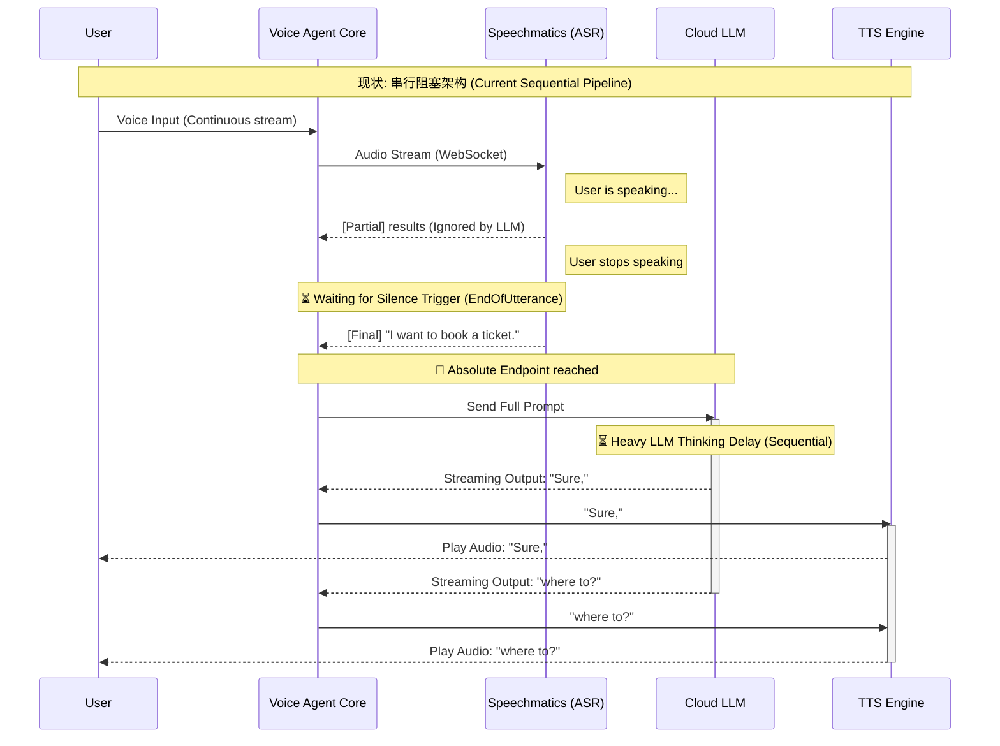
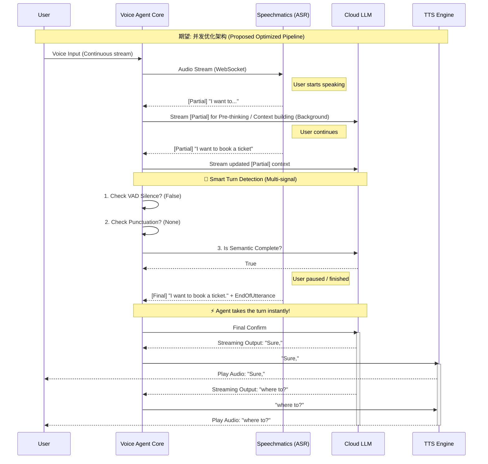

### 1. 现状：串行阻塞架构 (Current Sequential Pipeline)
目前系统完全依赖绝对断句，导致 LLM 思考时间产生显著的端到端延迟（Awkward pauses）。

### 2. 期望：利用 Partial 实现提前思考与智能断句 (Proposed Optimized Pipeline)
打破串行等待，让 LLM 的思考时间（Thinking Ahead）与 ASR 识别重叠，并结合多信号实现更敏捷的断句（Smart Turn Detection）。

