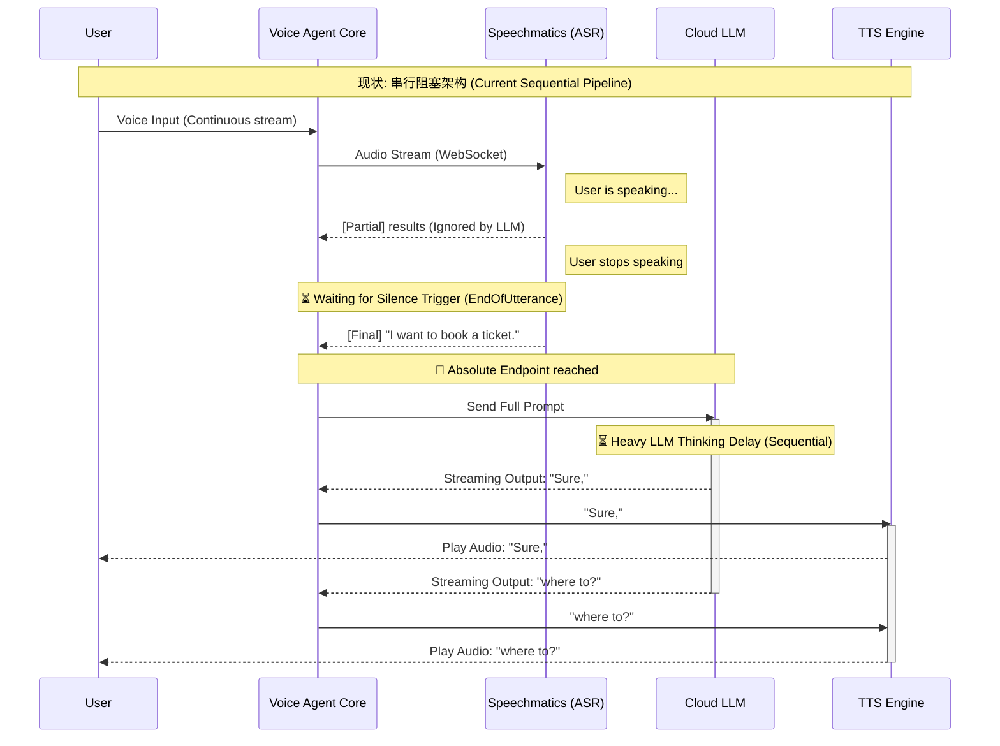
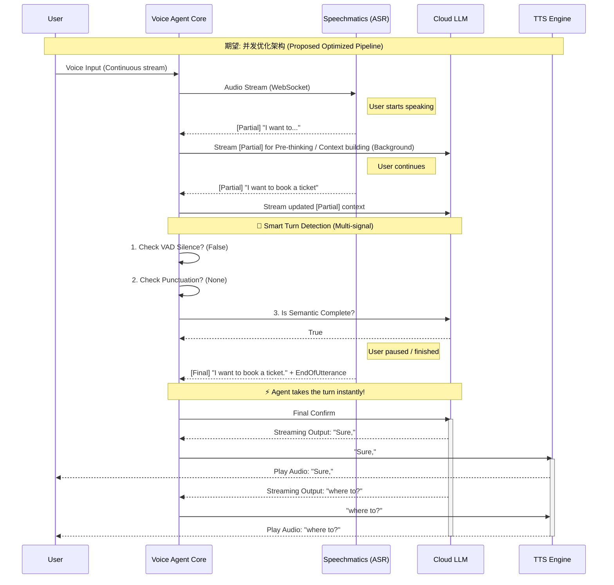

# Speechmatics 沟通会议脚本 (Meeting Script)

**会议目标:**
1. 沟通阿拉伯语 Smart Format 导致数字/日期乱码的严重缺陷，并利用日志证据寻求快速解决方案。
2. 探讨优化 ASR ➡️ LLM ➡️ TTS 链路延迟的最佳实践，特别是如何利用 Partial 结果让 LLM 提前思考，以及优化断句逻辑。

---

## 1. Arabic Entity Formatting Bug / 阿拉伯语实体格式化缺陷

**🗣️ 英文发言稿 (English Script):**

"Hi team, as mentioned in our email, we've encountered a critical blocker with Smart Formatting (`enable_entities`) for Arabic. I want to share a very interesting finding from our tests. 

When we look at the WebSocket transcription logs, your system actually gets the numbers right during the `[Partial]` phase! For example, for the year 2026, the partials show `2026` correctly, but the very next `[Final]` result completely hallucinates it into `و6` or random text.

Here is an exact trace from our log (New Recording 7):
```text
[Partial]: ثلاثة. 2026
[Partial]: . 20. 26
[Final]: 3 و6. 
```

Since the core ASR acoustic model is clearly picking up the correct digits in the partial phase, it seems your Inverse Text Normalization (ITN) or Entity Formatting layer is corrupting the text right before the final output. 

Our question is: Are there any quick workarounds we can use today? For instance, passing a specific dictionary, tweaking a hidden parameter, or a beta feature flag we could enable to bypass this formatting corruption while we wait for a formal patch?"

**🇨🇳 中文对照 (供内部参考):**

"Hi 团队，正如我们在邮件中提到的，我们在阿拉伯语的 Smart Format 上遇到了严重的问题。我想分享一个从我们的测试中发现的非常有趣的现象。

当我们查看 WebSocket 转写日志时，你们的系统实际上在 `[Partial]` (中间结果) 阶段是能正确识别出数字的！例如对于 2026 年，中间结果正确地输出了 `2026`，但紧接着的 `[Final]` 最终结果却完全幻听成了 `و6` 或者是乱码。

这是我们日志的原始片段 (Recording 7)：
```text
[Partial]: ثلاثة. 2026
[Partial]: . 20. 26
[Final]: 3 و6. 
```

既然底层的 ASR 声学模型显然在中间阶段抓取到了正确的数字，看起来是你们的逆文本正则化 (ITN) 或实体格式化层在最终输出前把数据搞坏了。

我们的问题是：请问目前有什么快速的解法或绕过方案吗？比如，我们能否传递特定的自定义词典、调整某个隐藏参数，或者开启某个 Beta 版的特性开关，作为正式修复前的临时方案？"

---

## 2. Optimizing ASR -> LLM Pipeline / 优化 ASR 到 LLM 的链路延迟与断句

**🗣️ 英文发言稿 (English Script):**

"The second topic is about our integration pipeline and end-to-end latency. Currently, our pipeline works sequentially: we wait for the ASR to trigger an absolute Endpoint (either waiting for `EndOfUtterance` or splitting by final punctuation), and only then do we send the completed text to the LLM. 

Because we use 3rd-party Cloud LLM APIs, this sequential process introduces noticeable delay. Sometimes the EndOfUtterance trigger is too slow, causing awkward pauses, or too fast, causing the agent to interrupt the user.

We have two architectural goals and would love to hear your best practices:

1. **Overlap ASR and LLM (Thinking Ahead):** We want to maximize the overlap between ASR processing and LLM thinking. Is there a recommended pattern to stream `[Partial]` ASR results directly to the LLM, so the LLM can start reasoning or pre-fetching contexts before the user even finishes their sentence? Have you seen other clients do this effectively?

2. **Multi-signal Turn Detection:** We want the agent to hold off on speaking more intelligently. Instead of relying solely on your VAD silence trigger, how can we best combine your partials, punctuation, and perhaps LLM semantic completeness to decide the exact moment the user has yielded the floor? 

Are there any advanced features in Speechmatics (like word-level timings on partials or specific endpointing configs) that could help us build a faster, more natural conversational agent?"

**🇨🇳 中文对照 (供内部参考):**

"第二个话题关于我们的集成链路和端到端延迟。目前我们的 pipeline 是串行的：我们等待 ASR 触发绝对的断句点（等待 `EndOfUtterance` 或根据标点符号截断），然后才把完整的句子发送给 LLM。

因为我们使用的是第三方云端 LLM API，这种串行流程引入了明显的延迟。有时候端点检测太慢导致尴尬的停顿，有时又太快导致 Agent 抢话打断用户。

我们有两个架构层面的目标，并希望听听你们的最佳实践：

1. **ASR 与 LLM 重叠执行 (提前思考):** 我们希望最大化 ASR 处理和 LLM 思考时间的重叠。有没有推荐的模式，能够将 ASR 的 `[Partial]` 中间结果直接推给 LLM，让 LLM 在用户还没说完时就开始“推理”或者预取上下文？你们有没有看到其他客户有效地实现过这点？

2. **多信号综合断句 (Turn Detection):** 我们希望 Agent 能更智能地判断开口时机。除了单纯依赖你们的 VAD 静音触发，我们如何才能最好地结合你们的 partials、标点符号、以及 LLM 的语义完整性，来综合判断用户确实交出了话语权？

Speechmatics 有没有什么高级特性（比如 partials 上的词级时间戳，或者特定的断句配置），能帮助我们构建一个响应更快、更自然的语音 Agent？"

---

## 附录: 架构时序图对比 (Pipeline Sequence Diagrams)

为了直观展示我们的痛点，你可以向对方对比展示以下两张时序图：**当前的串行架构** vs **我们期望的并发架构**。

### 1. 现状：串行阻塞架构 (Current Sequential Pipeline)
目前系统完全依赖绝对断句，导致 LLM 思考时间产生显著的端到端延迟（Awkward pauses）。



### 2. 期望：利用 Partial 实现提前思考与智能断句 (Proposed Optimized Pipeline)
打破串行等待，让 LLM 的思考时间（Thinking Ahead）与 ASR 识别重叠，并结合多信号实现更敏捷的断句（Smart Turn Detection）。

