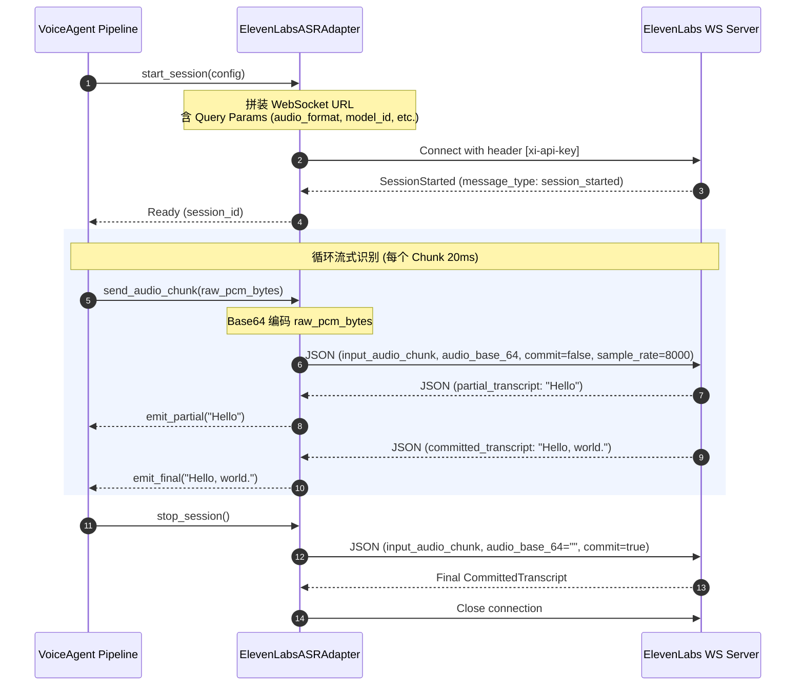

# ElevenLabs Realtime STT 厂商调研报告

> **调研日期**: 2026-07-08  
> **数据来源**: ElevenLabs 官方 AsyncAPI 规范 & 开发者参考手册 ([官方链接](https://elevenlabs.io/docs/api-reference/speech-to-text/v-1-speech-to-text-realtime))  
> **状态**: 基础对接指标已确认，8KHz 电话格式兼容性已确认，本地验证脚本就绪。

---

## 1. 概述与核心定位

ElevenLabs（以其业界领先的 TTS 音色克隆闻名）推出了其专有的语音识别大模型 **Scribe Realtime v2 (scribe_v2_realtime)**，并提供了全双工、低延迟的实时 WebSockets 接口。 
Scribe 在处理多种口音、嘈杂背景环境以及多语种自动切换时表现出极强的鲁棒性，是构建低延迟实时交互语音助手 (VoiceAgent) 的核心 ASR 候选厂商之一。

---

## 2. 计费、限制与配额

| 维度 | 规格 / 详情 | 来源 & 日期 |
| :--- | :--- | :--- |
| **计费标准** | 约 **$0.01 / 分钟** (具体根据订阅计划中字符与语音额度换算比例，企业用户可定制) | 官网 2026-07-08 |
| **并发限制 (Concurrency)** | 默认支持 3 - 100+ 并发通道 (依赖订阅计划 Tier) | 官网 2026-07-08 |
| **服务限制** | 最大单次 Session 会话时长限制：一般为 30 分钟 (超出会抛出 `session_time_limit_exceeded` 错误) | 官网 2026-07-08 |
| **数据隐私** | 企业级用户可设置 `enable_logging=false` 开启零保留模式 (Zero Retention)，历史记录不可用 | 官网 2026-07-08 |

---

## 3. 技术对接指标与 8KHz 兼容性

针对本项目 **“电话流式场景强制要求音频格式为 8KHz / 16bit / 单声道 PCM”** 的红线规范，ElevenLabs Realtime API 表现出完美的天然兼容性：

- **支持的音频格式** (`audio_format` 参数):
  - `pcm_8000` (8KHz / 16bit / 线性单声道 PCM) -> **项目电话场景推荐采用此格式**
  - `pcm_16000` (默认)
  - `pcm_22050`, `pcm_24000`, `pcm_44100`, `pcm_48000`
  - `ulaw_8000` (Mu-law 8KHz 电话常用高保真压缩格式)
- **协议类型**: 全双工 WebSocket (`wss://`)
- **握手认证方式**: 
  - HTTP 握手阶段 Header 携带 `xi-api-key: <YOUR_API_KEY>` 
  - 或在客户端直接使用单次 Token 并通过 URL 参数携带 `?token=<YOUR_TOKEN>`

---

## 4. 选型决策矩阵 (ASR 厂商多维度对比)

结合当前项目技术栈与对 Speechmatics、Soniox、Deepgram 等厂商的对接经验，ElevenLabs 实时 STT 对比如下：

| 维度 | ElevenLabs (Scribe) | Speechmatics | Deepgram (Nova-2) | Soniox | 腾讯云 (ASR) |
| :--- | :--- | :--- | :--- | :--- | :--- |
| **核心模型** | Scribe v1 | Ursa / Flow | Nova-2 / Flux | Soniox Predict | 自研流式模型 |
| **多语种/方言** | 极强 (自适应) | 极强 (ar_en 专长) | 强 (多语种独立) | 强 (阿语专长) | 极强 (中文及方言) |
| **8KHz 兼容性** | **支持 (`pcm_8000`)** | 支持 (`pcm_s16le`) | 支持 (`pcm`) | 支持 (`pcm_8000`) | 支持 (`pcm_8000`) |
| **消息帧开销** | **较高 (Base64 JSON)** | 极低 (二进制原始 PCM) | 极低 (二进制原始 PCM) | 极低 (二进制原始 PCM) | 中等 (二进制/自定义包头) |
| **打断与断句** | VAD 智能断句 | 内置 VAD & Turn | 快速 VAD | 动态 VAD | 服务端断句 |
| **热词字典** | 支持 (`keyterms`) | 极强 (`additional_vocab`)| 支持 (`keywords`) | 支持 | 支持 |
| **首包延迟** | 极低 (<200ms) | 中等 (~300ms) | 极低 (<150ms) | 极低 (<150ms) | 较低 (~250ms) |

---

## 5. 关键架构区别与避坑指南

### 5.1 二进制 vs Base64 JSON (最大坑点 ⚠️)
- **传统 ASR 厂商** (Speechmatics, Deepgram, Soniox) 在握手成功后，直接通过 WebSocket 发送 **Raw Binary PCM** 数据，开销极低。
- **ElevenLabs STT API** 发送音频时，**必须**使用结构化 JSON 消息。数据必须进行 **Base64 编码**：
  ```json
  {
    "message_type": "input_audio_chunk",
    "audio_base_64": "UklGRi...",
    "commit": false,
    "sample_rate": 8000
  }
  ```
  **注意**：不要直接向 WebSocket 连接写入 Raw Byte Array，否则会导致服务端由于解析失败而立即关闭连接！

### 5.2 策略外置与配置约束
- 所有参数均应外置在 `configs/vendor/elevenlabs/config.json` 中。
- 连接成功后，ElevenLabs 服务端会返回一个 `session_started` 消息，里面包含当前会话的 `session_id`。
- `commit_strategy` (提交策略) 有两种选项：
  - `manual`：需要客户端显式地在 chunk 消息中将 `"commit": true` 传过去，或者在一段话结束时补发带有 `commit: true` 的空块。
  - `vad`：**（推荐用于 VoiceAgent 实时通话）**，服务端内置 Voice Activity Detection 自动监测说话结束并进行 Commit，吐出 `committed_transcript` 或 `committed_transcript_with_timestamps`。

### 5.3 优雅关闭
音频流结束发送时，如果 `commit_strategy` 为 `manual`，应该发送最后一个包含 `"commit": true` 的音频块，或者等接收完服务端所有的 `committed_transcript` 结果后再关闭连接，防止丢字。

---

## 6. 对接设计草案 (BaseASR 适配器)

集成至本项目的 ASR 适配层（`src/asr/elevenlabs_adapter.py`）时，其内部逻辑设计如下：


